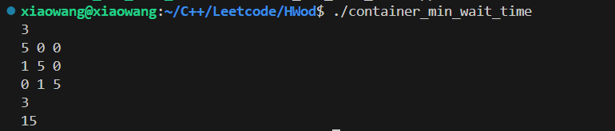

# 1204 容器最少等待时间

## 一.题目描述

> 现在有n个容器服务，服务的启动可能有一定的依赖性（有些服务启动没有依赖），其次服务自身启动加载会消耗一些时间。给你一个 n x n 的二维矩阵useTime，其中useTime[i][i]=10 表示服务i自身启动加载需要消耗10s useTime[i][j] = 1 表示服务i启动依赖服务j启动完成 useTime[i][k]=0 表示服务i启动不依赖服务k 其实 0<= i，j，k < n。
>
> 服务之间启动没有循环依赖（不会出现环），若想对任意一个服务i进行集成测试（服务i自身也需要加载），求最少需要等待多少时间。

***\*输入描述\****

> 第一行输入服务总量 n，之后的 n 行表示服务启动的依赖关系以及自身启动加载耗时，最后输入 k 表示计算需要等待多少时间后可以对服务 k 进行集成测，其中 1 <= k <=n，1<=n<=100

***\*输出描述\****

> 最少需要等待多少时间(s)后可以对服务 k 进行集成测试

***\*用例1\****

***\*输入\****

> 3
>
> 5 0 0
>
> 1 5 0
>
> 0 1 5
>
> 3

***\*输出\****

> 15
>
> 说明 服务3启动依赖服务2，服务2启动依赖服务1，由于服务1，2，3自身加载需要消耗5s，所以5+5+5=15，需要等待15s后可以对服务3进行集成测试

***\*用例2\****

***\*输入\****

> 3
>
> 5 0 0
>
> 1 10 1
>
> 1 0 11
>
> 2

***\*输出\****

> 26
>
> 说明 服务2启动依赖服务1和服务3，服务3启动需要依赖服务1，服务1，2，3自身加载需要消耗5s，10s，11s，所以5+10+11=26s，需要等待26s后可以对服务2进行集成测试。

***\*用例3\****

***\*输入\****

> 4
>
> 2 0 0 0
>
> 0 3 0 0
>
> 1 1 4 0
>
> 1 1 1 5
>
> 4

***\*输出\****

> 12
>
> 说明 服务3启动依赖服务1和服务2，服务4启动需要依赖服务1，2，3，服务1，2，3自身加载需要消耗2s,3s,4s,5s，所以3+4+5=12s（因为服务1和服务2可以同时启动），要等待12s后可以对服务4进行集成测试。

***\*用例4\****

***\*输入\****

> 5
>
> 1 0 0 0 0
>
> 0 2 0 0 0
>
> 1 1 3 0 0
>
> 1 1 0 4 0
>
> 0 0 1 1 5
>
> 5

***\*输出\****

> 11
>
> 说明 服务3启动依赖服务1和服务2，服务4启动需要依赖服务1，2，服务5启动需要依赖服务3，5，服务1，2，3，4，5自身加载需要消耗1s,2s,3s,4s,5s，所以2+4+5=11s（因为服务1和服务2可以同时启动，服务3和服务4可以同时启动），要等待11s后可以对服务5进行集成测试。


## 二.题解

```c++
#include <iostream>
#include <vector>
#include <queue>
#include <algorithm>
using namespace std;

int main() {
    int n;
    cin >> n;
    
    // 读取矩阵
    vector<vector<int>> useTime(n, vector<int>(n));
    for (int i = 0; i < n; i++) {
        for (int j = 0; j < n; j++) {
            cin >> useTime[i][j];
        }
    }
    
    int k;
    cin >> k;
    k--; // 转换为0-based索引
    
    // 计算每个服务的入度（依赖数量）
    vector<int> indegree(n, 0);
    // 记录依赖关系
    vector<vector<int>> dependencies(n);
    
    for (int i = 0; i < n; i++) {
        for (int j = 0; j < n; j++) {
            if (i != j && useTime[i][j] == 1) {
                dependencies[j].push_back(i); // j被i依赖
                indegree[i]++;
            }
        }
    }
    
    // 每个服务的最早完成时间
    vector<int> completionTime(n, 0);
    
    // 拓扑排序队列
    queue<int> q;
    
    // 初始化：没有依赖的服务可以立即开始
    for (int i = 0; i < n; i++) {
        if (indegree[i] == 0) {
            q.push(i);
            completionTime[i] = useTime[i][i]; // 只有自身启动时间
        }
    }
    
    // 拓扑排序
    while (!q.empty()) {
        int curr = q.front();
        q.pop();
        
        // 更新所有依赖curr的服务
        for (int dep : dependencies[curr]) {
            // dep的最早完成时间 = max(当前值, curr的完成时间 + dep自身时间)
            int candidateTime = completionTime[curr] + useTime[dep][dep];
            if (candidateTime > completionTime[dep]) {
                completionTime[dep] = candidateTime;
            }
            
            // 减少入度
            indegree[dep]--;
            if (indegree[dep] == 0) {
                q.push(dep);
            }
        }
    }
    
    // 输出服务k的最早完成时间
    cout << completionTime[k] << endl;
    
    return 0;
}
```

## 三.输入输出测试



