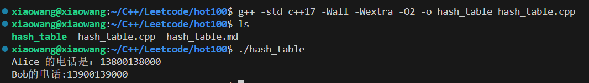
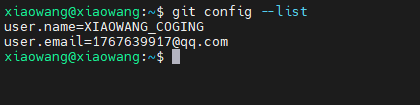
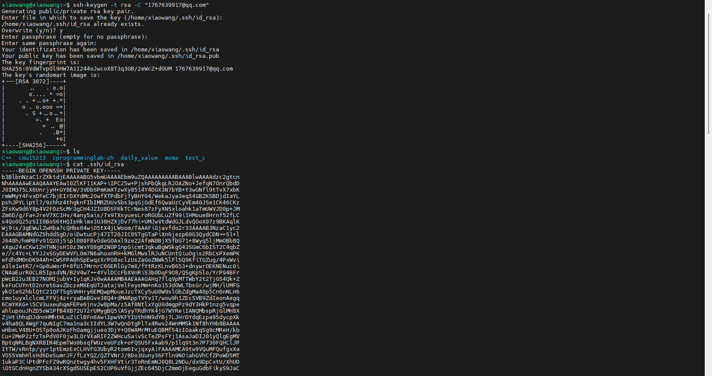
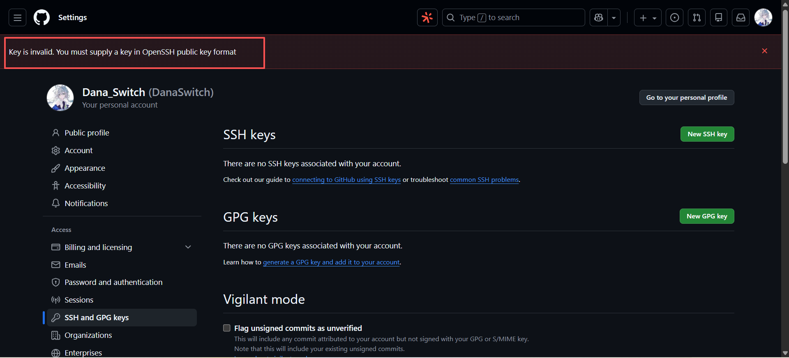
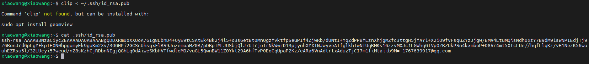
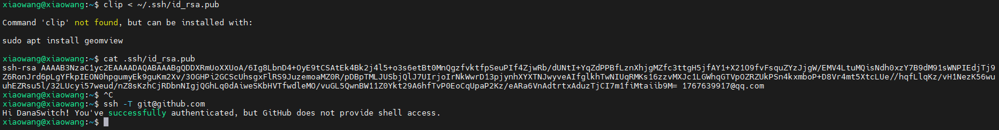

# 哈希表

## 一.知识积累

### 1.1 key，value，index的联系

| 要素  |            概念            |                      如何确定                       |             作用             |
| :---: | :------------------------: | :-------------------------------------------------: | :--------------------------: |
|  key  |       查找用的标识符       |                      用户提供                       | 用于确定要查找元素的存储位置 |
| value |   关联的数据，要查找的值   | hash(key)关联，一开始就创建好或者通过哈希函数来存放 |   通过哈希表找到关联的数据   |
| index | 哈希表中相关数据的数组下标 |                  hash(key)计算得出                  |   定位数据在哈希表中的位置   |


### 1.2 vector<int> 作为函数返回类型的优势

> 可以返回两个值，而int只能返回单个值，用参数返回又不够优雅。
>
> `vector<int>`
>  这是 C++ 标准库中的 **动态数组容器**，可以看作是一个“智能、可自动扩容的 int 数组”。它内部管理一块连续内存，存储多个 `int` 元素。


### 1.3 find()用法

```c++
#include <unordered_map>
#include <iostream>

int main() {
    unordered_map<int, string> hashMap = {
        {1, "Alice"},
        {2, "Bob"},
        {3, "Charlie"}
    };
    
    // 查找 key = 2
    auto it = hashMap.find(2);
    
    if (it != hashMap.end()) {
        cout << "找到: key=" << it->first 
             << ", value=" << it->second << endl;
    } else {
        cout << "未找到" << endl;
    }
    
    return 0;
}
```


```c++
#include <vector>
#include <iostream>
using namespace std;

void printVector(const vector<int>& nums) {
    for (int x : nums) {
        cout << x << " ";
    }
}

int main() {
    vector<int> myArray = {1, 2, 3, 4, 5};  // 定义一个 vector<int> 对象
    printVector(myArray);                   // 传入引用：nums 就是 myArray 的别名
    return 0;
}
```

- `myArray` 是一个 `vector<int>` 对象（包含 5 个 `int` 元素）。

- 在 `printVector` 函数中，`nums` 是 `myArray` 的**引用**，所以 `nums` 本身**不拷贝数据**，直接操作原对象。

- 你可以通过 `nums[0]`、`nums.size()` 等访问元素或属性，就像用 `myArray` 一样。


>使用引用的好处：
>
>- **避免拷贝**：`vector` 可能很大，传值会复制全部元素，效率低。
>- **允许修改原数据**（如果是非 `const` 引用）：


## 二.代码

```c++
#include<iostream>
#include<vector>
#include<unordered_map>
using namespace std;

class SimpleHashTable {
private:
    static const int TABLE_SIZE = 1000;
    vector<pair<int, int>> table[TABLE_SIZE];  // 使用链地址法解决冲突
    
    int hashFunction(int key) {
        return abs(key) % TABLE_SIZE;
    }
    
public:
    void insert(int key, int value) {
        int index = hashFunction(key);
        table[index].push_back({key, value});
    }
    
    bool find(int key, int& value) {
        int index = hashFunction(key);
        for (const auto& pair : table[index]) {
            if (pair.first == key) {
                value = pair.second;
                return true;
            }
        }
        return false;
    }
};

int main() {
    // 创建一个电话簿：key=姓名，value=电话号码
    unordered_map<string, string> phonebook;
    
    // 添加联系人
    phonebook["Alice"] = "13800138000";
    phonebook["Bob"] = "13900139000";
    phonebook["Charlie"] = "13700137000";
    
    // 用户想要查找Alice的电话号码
    string name = "Alice";  // key
    
    // 查找
    if (phonebook.find(name) != phonebook.end()) {
        string phoneNumber = phonebook[name];  // value
        cout << name << " 的电话是：" << phoneNumber << endl;
        // 输出：Alice 的电话是：13800138000
    }
    
    // 用户想要Bob的电话
    cout << "Bob的电话:" << phonebook["Bob"] << endl;
    // 输出：Bob的电话：13900139000
    
    return 0;
}
```




## 三.记录



通过SSH连接github




报错：原因是因为使用的是私有的公钥id_rsa，而不是公钥id_rsa.pub




复制公钥，这才对




大功告成，完成了我万里长征小小的一步！


经过验证，成功连接了SSH




参考链接

[https://blog.csdn.net/qq_29493173/article/details/113094143]: 


问题出在**反斜杠 `\`** 上！GitHub 的 Markdown 解析器使用的是 **正斜杠 `/`** 作为路径分隔符，而你的路径使用了 Windows 风格的反斜杠 `\`。

上传图片到github要使用反斜杠